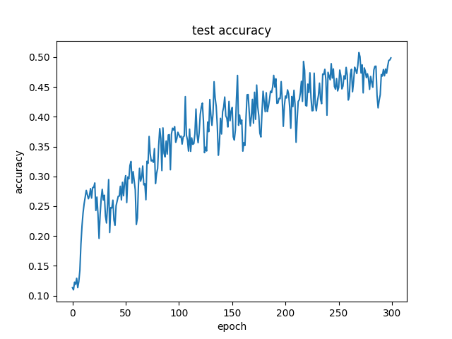
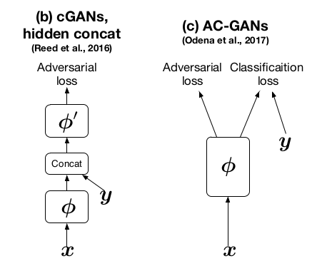

# Lab5: Let’s Play GANs

> Author: 311553007 應耀德

[TOC]

## Introduction

這次 Lab 原先採用 DCGAN + AC-GAN 的組合進行訓練，發現不管是調整 learning rate, optimizer，採用 [ganhacks](https://github.com/soumith/ganhacks) 的建議，加入 Label smoothing, Dropouts to Discriminator 來使訓練 GAN 時穩定一點，其結果還是不盡理想，一直在 12% 左右震盪，最終 accuracy 皆落在 20% 左右。

後來改用 DCGAN + cGAN 的組合進行訓練，其結果真的好很多，最終 accuracy 落在 60% 左右。(隨便跑都這分數... AC-GAN 卻...)

## Implementation details

### Describe how you implement your model, including your choice of cGAN, model architectures, and loss functions.

#### DCGAN (based) + cGAN (condition)

Loss functions: Binary Cross-Entropy With Logits (BCEWithLogitsLoss) = BCELoss + Sigmoid

**Objective function**
$$
\min\limits_{G}\max\limits_{D}V(D, G) = E_{x \sim p_{data}{(x)}}\ [\log D(x|c)] + E_{z \sim p_{z}{(z)}}\ [\log(1 - D(G(z|c)))]
$$
**Discriminator loss function**
$$
\min L_{D} = - E_{x \sim p_{data}{(x)}}\ [\log D(x|c)] + E_{x \sim p_{g}{(x)}}\ [\log D(x|c)]
$$
**Generator loss function**
$$
\min L_{G} = - E_{x \sim p_{g}{(x)}}\ [\log D(x|c)]
$$

```python
import torch
import torch.nn as nn

ngf = ndf = 64


class CGANGenerator(nn.Module):
    _in_channels: int

    def __init__(self, n_classes: int, z_dim: int, out_channels: int):
        super(CGANGenerator, self).__init__()

        self._z_dim = z_dim
        self._n_classes = n_classes

        def conv_block(
            in_channels: int,
            out_channels: int,
            kernel_size: int,
            stride: int,
            padding: int,
            bias: bool = False,
            normalization: bool = True,
        ):
            layers = [
                nn.ConvTranspose2d(
                    in_channels,
                    out_channels,
                    kernel_size,
                    stride,
                    padding,
                    bias=bias,
                )
            ]
            if normalization:
                layers.append(nn.BatchNorm2d(out_channels))
            layers.append(nn.LeakyReLU(inplace=True))
            return layers

        # like nn.Embedding but for multi-label task
        self.embedding = nn.Sequential(
            nn.ConvTranspose2d(
                n_classes, n_classes, 4, 1, 0, bias=False, groups=n_classes
            ),
            nn.LeakyReLU(inplace=True),
            nn.Flatten(),
            nn.Linear(n_classes * 4 * 4, z_dim, bias=False),
            nn.LeakyReLU(inplace=True),
        )

        self.main = nn.Sequential(
            *conv_block(z_dim * 2, ngf * 8, 4, 1, 0),
            # state size. (ngf*8) x 4 x 4
            *conv_block(ngf * 8, ngf * 4, 4, 2, 1),
            # state size. (ngf*4) x 8 x 8
            *conv_block(ngf * 4, ngf * 2, 4, 2, 1),
            # state size. (ngf*2) x 16 x 16
            *conv_block(ngf * 2, ngf, 4, 2, 1),
            # state size. (ngf) x 32 x 32
            nn.ConvTranspose2d(ngf, out_channels, 4, 2, 1, bias=False),
            nn.Tanh()
            # state size. (nc) x 64 x 64
        )

    def forward(self, x: torch.Tensor, label: torch.Tensor):
        x = x.view(-1, self._z_dim, 1, 1)
        label = label.view(-1, self._n_classes, 1, 1)

        condition = self.embedding(label).view(-1, self._z_dim, 1, 1)
        return self.main(torch.concat((x, condition), dim=1))


class CGANDiscriminator(nn.Module):
    def __init__(self, in_channels: int, n_classes: int):
        super(CGANDiscriminator, self).__init__()

        self._image_size = 64
        self._in_channels = in_channels
        self._n_classes = n_classes

        def conv_block(
            in_channels: int,
            out_channels: int,
            kernel_size: int,
            stride: int,
            padding: int,
            bias: bool = False,
            normalization: bool = True,
        ):
            layers = [
                nn.Conv2d(
                    in_channels,
                    out_channels,
                    kernel_size,
                    stride,
                    padding,
                    bias=bias,
                )
            ]
            if normalization:
                layers.append(nn.BatchNorm2d(out_channels))
            layers.append(nn.LeakyReLU(0.2, inplace=True))
            return layers

        self.embedding = nn.Sequential(
            nn.ConvTranspose2d(
                n_classes, n_classes, 4, 1, 0, bias=False, groups=n_classes
            ),
            nn.LeakyReLU(0.2, inplace=True),
            nn.Flatten(),
            nn.Linear(
                n_classes * 4 * 4,
                in_channels * self._image_size**2,
                bias=False,
            ),
            nn.LeakyReLU(0.2, inplace=True),
        )

        self.convs = nn.Sequential(
            # input is (nc) x 64 x 64
            *conv_block(in_channels * 2, ndf, 4, 2, 1, normalization=False),
            # state size. (ndf) x 32 x 32
            *conv_block(ndf, ndf * 2, 4, 2, 1),
            # state size. (ndf*2) x 16 x 16
            *conv_block(ndf * 2, ndf * 4, 4, 2, 1),
            # state size. (ndf*4) x 8 x 8
            *conv_block(ndf * 4, ndf * 8, 4, 2, 1),
        )

        # output networks
        # state size. (ndf*8) x 4 x 4
        self.adversarial_network = nn.Sequential(
            nn.Conv2d(ndf * 8, 1, 4, 1, 0, bias=False), nn.Flatten()
        )

    def forward(self, x: torch.Tensor, label: torch.Tensor):
        label = label.view(-1, self._n_classes, 1, 1)

        condition = self.embedding(label).view(
            -1, self._in_channels, self._image_size, self._image_size
        )
        output = self.convs(torch.concat([x, condition], dim=1))
        real_or_fake = self.adversarial_network(output)
        return real_or_fake
```


#### DCGAN (based) + AC-GAN (condition)

Loss functions: Binary Cross-Entropy With Logits (BCEWithLogitsLoss) = BCELoss + Sigmoid

**Objective function**
$$
\max\limits_{D}V(D) = L_{S} + L_{C}
\\
\max\limits_{G}V(G) = - L_{S} + L_{C}
\\
L_{S} = E_{x \sim p_{data}{(x)}}\ [\log D(x|c)] + E_{z \sim p_{z}{(z)}}\ [\log(1 - D(G(z|c)))]
\\
L_{C} = E_{x \sim p_{data}{(x)}}\ [\log D(c|x)] + E_{z \sim p_{z}{(z)}}\ [\log D(c|G(z|c))]
$$
**Discriminator loss function**
$$
\min L_{D} = - E_{x \sim p_{data}{(x)}}\ [\log D(x|c)] + E_{x \sim p_{g}{(x)}}\ [\log D(x|c)] + L_{C}
$$
**Generator loss function**
$$
\min L_{G} = - E_{x \sim p_{g}{(x)}}\ [\log D(x|c)] + E_{z \sim p_{z}{(z)}}\ [\log D(c|G(z|c))]
\\
\ \ \ \ = - E_{x \sim p_{g}{(x)}}\ [\log D(x|c)] + E_{x \sim p_{g}{(x)}}\ [\log D(c|x)]
$$

```python
import torch
import torch.nn as nn

ngf = ndf = 64


class ACGANGenerator(nn.Module):
    _in_channels: int

    def __init__(self, n_classes: int, z_dim: int, out_channels: int):
        super(ACGANGenerator, self).__init__()

        self._z_dim = z_dim
        self._n_classes = n_classes

        def conv_block(
            in_channels: int,
            out_channels: int,
            kernel_size: int,
            stride: int,
            padding: int,
            bias: bool = False,
            normalization: bool = True,
        ):
            layers = [
                nn.ConvTranspose2d(
                    in_channels,
                    out_channels,
                    kernel_size,
                    stride,
                    padding,
                    bias=bias,
                ),
            ]
            if normalization:
                layers.append(nn.BatchNorm2d(out_channels))
            layers.append(nn.ReLU(inplace=True))
            return layers

        # state size. n_classes x 1
        # like nn.Embedding but for multi-label task
        self.embedding = nn.ConvTranspose2d(
            n_classes, n_classes, 4, 1, 0, bias=False, groups=n_classes
        )
        # state size. n_classes x 4 x 4

        self.l1 = nn.Sequential(
            *conv_block(z_dim, ngf * 8, 4, 1, 0, normalization=False)
        )
        self.main = nn.Sequential(
            # state size. (ngf*8) x 4 x 4
            *conv_block(ngf * 8 + n_classes, ngf * 4, 4, 2, 1),
            # state size. (ngf*4) x 8 x 8
            *conv_block(ngf * 4, ngf * 2, 4, 2, 1),
            # state size. (ngf*2) x 16 x 16
            *conv_block(ngf * 2, ngf, 4, 2, 1),
            # state size. (ngf) x 32 x 32
            nn.ConvTranspose2d(ngf, out_channels, 4, 2, 1, bias=False),
            nn.Tanh()
            # state size. (nc) x 64 x 64
        )

    def forward(self, x: torch.Tensor, label: torch.Tensor):
        x = x.view(-1, self._z_dim, 1, 1)
        label = label.view(-1, self._n_classes, 1, 1)

        x = self.l1(x)
        condition = self.embedding(label)
        return self.main(torch.concat((x, condition), dim=1))


class ACGANDiscriminator(nn.Module):
    def __init__(self, in_channels: int, n_classes: int):
        super(ACGANDiscriminator, self).__init__()

        def conv_block(
            in_channels: int,
            out_channels: int,
            kernel_size: int,
            stride: int,
            padding: int,
            bias: bool = False,
            normalization: bool = True,
        ):
            layers = [
                nn.Conv2d(
                    in_channels,
                    out_channels,
                    kernel_size,
                    stride,
                    padding,
                    bias=bias,
                ),
                nn.LeakyReLU(0.2, inplace=True),
                nn.Dropout2d(0.5),
            ]
            if normalization:
                layers.append(nn.BatchNorm2d(out_channels))
            # layers.append(nn.LeakyReLU(0.2, inplace=True))
            return layers

        self.convs = nn.Sequential(
            # input is (nc) x 64 x 64
            *conv_block(in_channels, ndf, 4, 2, 1, normalization=False),
            # state size. (ndf) x 32 x 32
            *conv_block(ndf, ndf * 2, 4, 2, 1),
            # state size. (ndf*2) x 16 x 16
            *conv_block(ndf * 2, ndf * 4, 4, 2, 1),
            # state size. (ndf*4) x 8 x 8
            *conv_block(ndf * 4, ndf * 8, 4, 2, 1),
        )

        # output networks
        # state size. (ndf*8) x 4 x 4
        self.adversarial_network = nn.Sequential(
            nn.Conv2d(ndf * 8, 1, 4, 1, 0, bias=False), nn.Flatten()
        )

        # state size. (ndf*8) x 4 x 4
        self.labels_classifier = nn.Sequential(
            nn.Conv2d(ndf * 8, n_classes, 4, 1, 0, bias=False), nn.Flatten()
        )

    def forward(self, x: torch.Tensor):
        output = self.convs(x)
        real_or_fake = self.adversarial_network(output)
        labels = self.labels_classifier(output)
        return real_or_fake, labels
```

### Specify the hyperparameters (learning rate, epochs, etc.)

* Image transformation: `Resize(64) -> CenterCrop(64) -> ToTensor() -> Normalize((0.5, 0.5, 0.5), (0.5, 0.5, 0.5))`

* Batch Size: 64

* Epoch Size: 300

* Z Dimension: 100

* Momentum: 0.5

* Generator

  Optimizer: Adam

  Learning Rate: $4e^{-4}$ 

* Discriminator

  Optimizer: Adam

  Learning Rate: $1e^{-4}$

## Results and Discussion

### Show your results based on the testing data

>  只列出成功訓練的結果 DCGAN + cGAN

產生的出來的 objects 都有類似情況，有的物體被切一半，有的像是兩個被切半的物體接在一起斜一邊

目前猜測是 Image transformation 的 CenterCrop 造成某些在邊緣的物體被切一半，需要另外實驗才能知道情況。


<div style='display: flex; justify-content: center;'>
    <div style='text-align: center'>
        
        <h4>Test</h4>
    </div>
    <div style='text-align: center'>
        
        <h4>New Test</h4>
    </div>
</div>

### Discuss the results of different models architectures

#### cGAN learning rate comparison

discriminator 更新過快，「 loss variance 過高，同時也牽制 discriminator 對 fake image (G loss) 的辨別能力，收斂速度較慢

反之，4:1 的 learning rate 較為穩定，也較早收斂

* Generator lr: $2e^{-4}$

  Discriminator lr: $2e^{-4}$

  Momentum: 0.5

<div style='text-align: center'>
    
    
</div>

* Generator lr: $4e^{-4}$

  Discriminator lr: $1e^{-4}$

  Momentum: 0.5

<div style='text-align: center'>
    
    
</div>

#### AC-GAN vs. cGAN

兩者架構除了 Discriminator 與 Loss function 不同以外，Generator 的 condition 方式皆採用 concat 的作法

下圖為 cGAN Discriminator 與 AC-GAN Discriminator 的對比圖，一個直接與 $x$ 做 concat embedding，另一個則是把 condition 當作 classification target 來輔助 GAN 學習



就如在 Introduction 中所說，自己認為是因為 AC-GAN 採用 auxiliary classifier 當作輔助訓練器，而在 GAN 前期 epoch 產生的圖片基本上都是雜訊，對 classifier 來說辨別效果有限甚至影響學習狀況，所以比 cGAN 這種直接 embed 進 image 後再丟入 Discriminator 中還難學習。
但因實驗時間太長，無法再繼續做相關實驗，只能等到課程結束後自己在慢慢 tuning。

以下是兩套架構所跑出的訓練情況，從 loss 訓練情況來看，很難判斷 learning 有問題，Generator loss 正常提高，代表它能產生 fake 假圖片資料，而不是一堆垃圾給 Discriminator，Discriminator 提高辨別精度 loss 降低，屬正常訓練情況。

但就從 accuracy 來看，差異就非常大 (註: accuracy 單位為 epoch，是 average accuracy，與 test results 不一樣)

##### AC-GAN

<div style='text-align: center'>
    
    
</div>

##### cGAN

<div style='text-align: center'>
    
    
</div>